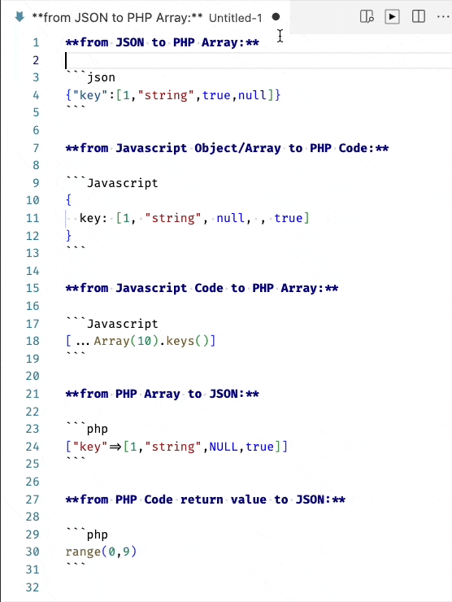

# PHP Array from JSON or JavaScript

Convert a selected text area with JSON or Javascript Object/Array to/from PHP Array notation.
If the selected text is empty it will take the content of the clipboard an inserts at the current cursor position.

[](https://marketplace.visualstudio.com/items?itemName=heissenbergerlab.php-array-from-json)   

## Features

- User selected text or clipboard content
- Convert from JSON to PHP Array
- Convert from Javascript Objects, Array to PHP Array
- Convert from PHP Array to JSON
- Convert the result of function written in PHP or Javascript to JSON / PHP Array

## Preview



## Release Notes

see [Changelog](CHANGELOG.md)

### Command `JSON to PHP Array`

**from JSON:**

```json
{ "key": [1, "string", true, null] }
```

**to PHP Array:**

```php
["key"=>[1,"string",true]]
```

### Command `JS Object/Array to PHP Array`

supports Javascript Sparse Arrays

**from Javascript Object/Array:**

```js
{
  key: [1, "string", NULL, , true];
}
```

**to PHP Code:**

```php
["key"=>[1,"string",NULL,NULL,true]]
```

Function calls are interpreted, which allows generate output with any javascript function which is part of the text selection:

**from Javascript Code:**

```js
[...Array(10).keys()];
```

**to PHP Array:**

```php
[0,1,2,3,4,5,6,7,8,9]
```

### Command `JSON from PHP Array`

**from PHP Array:**

```php
["key"=>[1,"string",NULL,true]]
```

**to JSON:**

```json
{key:[1,"string",NULL,true]}
```

Function calls are interpreted, which allows generate output with any php function which is part of the text selection:

**from PHP Code return value:**

```php
range(0,9)
```

**to JSON:**

```json
[0, 1, 2, 3, 4, 5, 6, 7, 8, 9]
```

## Requirements

Command `JSON from PHP Array` a local `php` binary is required.

## Extension Settings

This extension contributes the following settings:

- `php-array-from-json.phpexec`: Set to path of your `php` binary if the extention cannot find it based on the systems `PATH` settings. Error: `Invalid PHP Array Code: Error: spawn php ENOENT`

<!--
## Known Issues

Calling out known issues can help limit users opening duplicate issues against your extension.
-->

## Out of Scope requirements

This is a list of features which are not planed to implement:

- Formating the converted result - not needed as there are allready builtin tools which can do this and in most cases the minified version is needed.
